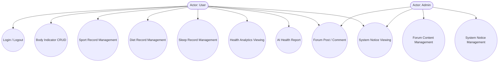

<objective>
Add feasibility analysis section (TH-03) and Mermaid use case diagram (TH-04) to Chapter 3. Insert new section 3.1 (可行性分析) before the existing section 3.1, renumbering the existing 3.1 需求分析 to 3.2. Add a Mermaid use case diagram to the requirements analysis section showing User and Admin actors with 10-12 use cases.
</objective>

<execution_context>
@D:/SpringBoot-based-personal-health-center-system/.claude/get-shit-done/workflows/execute-plan.md
@D:/SpringBoot-based-personal-health-center-system/.claude/get-shit-done/templates/summary.md
</execution_context>

<context>
@毕业论文初稿.md
@.planning/phases/01-thesis-foundation/01-CONTEXT.md
@.planning/phases/01-thesis-foundation/01-RESEARCH.md
</context>

<interfaces>
<!-- Not applicable — this is a documentation-only task modifying existing thesis text -->
</interfaces>

<tasks>

<task type="auto">
  <name>Task 1: Add Section 3.1 feasibility analysis (technical, economic, operational) with heading renumbering</name>
  <files>毕业论文初稿.md</files>
  <read_first>毕业论文初稿.md</read_first>
  <action>
STEP A — Renumber existing headings:
Find the existing "### 3.1 需求分析" heading and rename it to "### 3.2 需求分析".
Find "#### 3.1.1 功能性需求" and rename it to "#### 3.2.1 功能性需求".
Find "#### 3.1.2 非功能性需求" and rename it to "#### 3.2.2 非功能性需求".

STEP B — Insert new Section 3.1 BEFORE the renumbered "### 3.2 需求分析":
Insert a new top-level section "### 3.1 可行性分析" with three subsections immediately before "### 3.2 需求分析".

The new section to INSERT:

---

#### 3.1.1 技术可行性

本系统采用SpringBoot + Vue 3 + Element Plus + MySQL + ECharts的技术架构方案，从技术层面分析是切实可行的。前端选用Vue.js 3.5.24作为开发框架，其组件化开发模式和响应式数据绑定机制能够高效构建交互式用户界面；配合Vite 7.3.4构建工具，可实现毫秒级热更新和高效的生产环境打包。Element Plus 2.12.0组件库提供了丰富的可复用UI组件，大幅降低了开发复杂度。后端选用SpringBoot 3.x框架，最低支持Java 17，充分利用了Java的新特性简化代码编写；MyBatis作为ORM框架提供了灵活的SQL编写能力和高效的数据库访问性能。数据库采用MySQL 8.0，其成熟的事务处理机制、崩溃恢复能力和丰富的数据类型支持能够满足系统对数据持久化的需求。数据可视化选用ECharts 6.0，其丰富的图表类型、高性能渲染能力和良好的跨平台兼容性能够实现复杂健康数据的直观展示。

从成熟度来看，Vue.js自2014年发布至今已迭代至第3个大版本，拥有庞大的社区生态和详尽的官方文档；SpringBoot作为Spring生态的核心框架，已被广泛应用于各类企业级应用开发；MySQL作为最流行的开源关系型数据库，在全球范围内拥有广泛的用户基础和技术支持。ECharts作为百度开源的数据可视化库，在国内项目中的应用非常普遍。综合分析，本系统所选技术栈均经过大量项目验证，技术成熟度高，相关技术文档和社区资源丰富，开发过程中遇到的问题能够通过官方文档或社区搜索得到有效解决。

#### 3.1.2 经济可行性

从经济角度分析，本系统的开发成本主要包含以下几个方面：首先是开发人力成本，系统采用前后端分离架构，前端基于Vue.js的组件化开发模式允许开发者高效复用已有组件，后端基于SpringBoot的自动配置特性减少了大量繁琐的配置工作，这些都有效降低了开发难度和时间成本；其次是服务器和运维成本，系统可部署在主流云服务平台上，按需选择配置和计费模式，避免了前期固定资产的大量投入；再者是后期维护成本，Vue.js和SpringBoot的模块化设计使得系统各部分职责清晰，维护人员能够快速定位和修复问题，降低了维护成本。

从效益角度分析，本系统为用户提供了便捷的自我健康管理工具，能够帮助用户及时发现健康异常并采取改善措施，具有一定的社会效益。对于开发者而言，通过本项目的开发实践，能够深入掌握前后端分离架构的设计理念和开发技术，积累完整的项目开发经验，这将对未来的职业发展产生积极影响。综合成本效益分析，本系统的开发投入在可承受范围内，而其带来的应用价值和学习价值是显而易见的，经济可行性得到了充分论证。

#### 3.1.3 操作可行性

本系统的目标用户为需要进行日常健康管理的普通人群，包括注重健康的年轻人、慢性病患者以及老年用户的家庭成员等。从用户界面设计角度，系统采用B/S架构，用户通过浏览器即可访问，无需安装专门的客户端软件，降低了使用门槛。页面设计遵循简洁美观、操作直观的原则，各功能模块入口清晰，用户可以快速找到所需功能。Element Plus组件库提供了一致的设计语言和流畅的交互动效，使得整体用户体验较为流畅。

从用户学习成本角度，系统不设置过于复杂的认证流程或专业术语，用户可以快速注册并上手使用。健康数据的录入采用表单+日期选择的交互方式，与用户日常使用其他应用的习惯一致。数据可视化图表支持鼠标悬停显示详细数值、点击切换时间范围等直观交互，用户无需复杂培训即可理解图表所表达的健康趋势。系统支持响应式布局，能够自适应不同尺寸的屏幕，方便用户在手机、平板和电脑等不同设备上使用。综合分析，本系统的操作流程和用户界面设计充分考虑了目标用户的使用习惯和认知特点，操作可行性较高。

---

</action>
  <verify>
<automated>grep -c "3.1 可行性分析" 毕业论文初稿.md && grep -c "3.2 需求分析" 毕业论文初稿.md && grep -c "3.1.1 技术可行性" 毕业论文初稿.md && grep -c "3.2.1 功能性需求" 毕业论文初稿.md</automated>
  </verify>
  <done>Section 3.1 contains three subsections (技术可行性, 经济可行性, 操作可行性) totaling approximately 600 words; existing 3.1 需求分析 renumbered to 3.2</done>
</task>

<task type="auto">
  <name>Task 2: Add Mermaid use case diagram to requirements section</name>
  <files>毕业论文初稿.md</files>
  <read_first>毕业论文初稿.md</read_first>
  <action>
Find the section "#### 3.2.2 非功能性需求" (after the functional requirements paragraphs, previously 3.1.2). INSERT the following Mermaid use case diagram BEFORE the "#### 3.2.2" heading, as a visual supplement to the functional requirements described in 3.2.1.

The insertion point is: after the last paragraph of 3.2.1 ends (which describes "第九，系统公告功能...") and before "#### 3.2.2 非功能性需求".

Insert this Mermaid diagram block:

---

**图3-1 系统用例图**

---

Note: "系统公告功能" in 3.2.1 describes User viewing notices (UC9), and Admin publishing notices (UC11). Forum content management (UC10) is for Admin to delete posts.
</action>
  <verify>
<automated>grep -c "graph TD" 毕业论文初稿.md && grep -c "Actor: User" 毕业论文初稿.md</automated>
  </verify>
  <done>Requirements section contains Mermaid use case diagram with 11 use cases (UC1-UC11), 2 actors (User, Admin), covering all 9 functional areas</done>
</task>

</tasks>

<threat_model>
## Trust Boundaries

| Boundary | Description |
|----------|-------------|
| N/A | Documentation-only phase — no trust boundaries |

## STRIDE Threat Register

| Threat ID | Category | Component | Disposition | Mitigation Plan |
|-----------|----------|-----------|-------------|-----------------|
| T-01-03 | Tampering | 毕业论文初稿.md | mitigate | Edit tool with atomic file writes — no partial corruption risk |
| T-01-04 | Information | Chinese text encoding | mitigate | Windows file system UTF-8 compatible, Write tool preserves encoding |
</threat_model>

<verification>
After both tasks:
- `grep -c "技术可行性" 毕业论文初稿.md` returns count >= 1
- `grep -c "graph TD" 毕业论文初稿.md` returns count >= 1
- `grep -c "Actor: User" 毕业论文初稿.md` returns count >= 1
- `grep -c "Actor: Admin" 毕业论文初稿.md` returns count >= 1
</verification>

<success_criteria>
1. Section 3.1 contains technical feasibility analysis (SpringBoot+Vue+MySQL+ECharts viability)
2. Section 3.1 contains economic feasibility analysis (cost considerations)
3. Section 3.1 contains operational feasibility analysis (ease of use)
4. Total feasibility analysis approximately 600 words
5. Existing 3.1 需求分析 renumbered to 3.2 需求分析
6. Mermaid use case diagram has 11 use cases covering all 9 functional areas
7. Use case diagram has 2 actors (User, Admin)
8. Diagram uses standard Mermaid graph TD syntax with ((ellipse)) use cases and ([actor]) notation
</success_criteria>

<output>
After completion, create `.planning/phases/01-thesis-foundation/01-02-SUMMARY.md`
</output>
