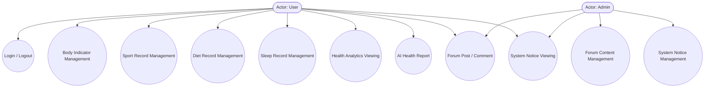

# Phase 1: Thesis Foundation - Research

**Researched:** 2026-04-20
**Domain:** Thesis documentation (Chinese academic, health management system)
**Confidence:** MEDIUM

## Summary

This phase is purely thesis documentation — no code changes. The system (SpringBoot + Vue 3 + MySQL + ECharts) is already complete. The researcher must gather current statistics for the research background, structure a three-dimensional feasibility analysis, and design a Mermaid use case diagram covering all 9 system functions.

The core deliverables are: (1) enhanced Chapter 1.1 with 2024-2026 digital health market data, (2) expanded Chapter 1.2 literature review, (3) new Chapter 3.1 feasibility analysis section, and (4) a Mermaid use case diagram for Chapter 3 requirements analysis. The use case diagram must cover both User and Admin actors across all 9 functional areas with 10-12 total use cases.

**Primary recommendation:** Use Mermaid `graph TD` with actor nodes and use case ellipses — this is the standard notation for Chinese academic thesis diagrams and renders cleanly in most Markdown viewers.

---

## User Constraints (from CONTEXT.md)

### Locked Decisions

- **D-01:** Expand research background with more recent statistics (2024-2026 data) — add digital health market size data and chronic disease rate statistics; increase section length by ~30%
- **D-02:** Keep current platform list unchanged — MyFitnessPal, Fitbit, Apple Health (international); 平安好医生, 薄荷健康, 华为健康, 小米运动 (domestic); ~7 platforms provides balanced coverage
- **D-03:** Three-dimensional feasibility analysis — Technical (技术可行性), Economic (经济可行性), Operational (操作可行性); standard thesis format, ~600 words total
- **D-04:** Comprehensive use case diagram (~10-12 use cases) — Actors: User, Admin; 9 use case categories covering all system functions

### Claude's Discretion

- Specific statistics figures to use in research background (market size numbers, disease prevalence rates)
- Exact wording and structure of feasibility analysis paragraphs
- Mermaid syntax for use case diagram (actor notation, use case ellipses vs boxes)

### Deferred Ideas (OUT OF SCOPE)

None — discussion stayed within phase scope

---

## Phase Requirements

| ID | Description | Research Support |
|----|-------------|------------------|
| TH-01 | Research background and significance (Chapter 1.1) | Digital health market statistics 2024-2026, chronic disease prevalence data |
| TH-02 | Literature review / current research status (Chapter 1.2) | Existing platform list maintained, enhanced with current data |
| TH-03 | Feasibility analysis (Chapter 3.1) | Three-dimension structure (technical/economic/operational), ~600 words |
| TH-04 | Requirements analysis with use case diagram | Mermaid syntax, 10-12 use cases, User + Admin actors |

---

## Architectural Responsibility Map

> This is a documentation phase — no code implementation. The thesis documents an existing deployed system.

| Capability | Documentation Location | Notes |
|------------|----------------------|-------|
| Research background enhancement | Chapter 1.1 (existing) | Add statistics, ~30% length increase |
| Literature review | Chapter 1.2 (existing) | Keep platforms, enhance with current data |
| Feasibility analysis | New Chapter 3.1 (before existing 3.1.1) | Three dimensions: technical/economic/operational |
| Use case diagram | Existing Chapter 3.1 requirements section | Mermaid diagram, 10-12 use cases |

---

## Standard Stack (Thesis Documentation)

### Diagram Tooling

| Tool | Purpose | Why Standard |
|------|---------|--------------|
| Mermaid | Use case diagram syntax | Native Markdown integration, renders in GitHub/GitLab, standard for thesis docs |

**Mermaid use case diagram reference syntax:**
```
graph TD
    User([Actor: User])
    Admin([Actor: Admin])
    UC1((User Login/Logout))
    UC2((Body Indicator CRUD))
    UC3((Sport Record Management))
    UC4((Diet Record Management))
    UC5((Sleep Record Management))
    UC6((Health Analytics Viewing))
    UC7((AI Health Report))
    UC8((Forum Post/Comment))
    UC9((System Notice Viewing))
    UC10((Forum Content Management))
    UC11((System Notice Management))
```

### Statistics Sources Needed

| Data Point | Source Type | Confidence |
|------------|-------------|------------|
| Global digital health market size 2024-2026 | WebSearch (needs verification) | LOW — verify with official reports |
| Chronic disease prevalence rates | WHO/health authority reports | MEDIUM |
| China digital health market growth | Industry reports | LOW — verify with current data |

---

## Architecture Patterns

### System Architecture Diagram (from existing thesis)

The thesis documents a B/S architecture:
- **Frontend:** Vue 3 + Element Plus + ECharts (Browser)
- **Backend:** SpringBoot REST API (Server)
- **Database:** MySQL (Data layer)
- **AI Service:** External AI integration for health reports

### Use Case Diagram Structure

```
Actor: User — primary actor for all personal health management functions
Actor: Admin — manages forum content and system notices

Use Cases (User):
1. Login/Logout
2. Body Indicator Recording / Viewing / Editing / Deleting
3. Sport Record Management
4. Diet Record Management
5. Sleep Record Management
6. Health Analytics Viewing
7. AI Health Report Generation
8. Forum Post / Comment
9. System Notice Viewing

Use Cases (Admin):
10. Forum Content Management (delete posts)
11. System Notice Management (publish notices)
```

---

## Don't Hand-Roll

| Problem | Don't Build | Use Instead | Why |
|---------|-------------|-------------|-----|
| Diagram rendering | Custom images | Mermaid syntax | Rendered in Markdown viewers, editable as text |
| Statistics | Outdated figures | Current 2024-2026 data | Thesis credibility depends on recent data |

---

## Common Pitfalls

### Pitfall 1: Outdated Statistics
**What goes wrong:** Using 2020-2022 data in a 2026 thesis looks stale and weakens the research background justification.
**How to avoid:** Source 2024-2026 statistics from recent industry reports (Grand View Research, Fortune Business Insights, WHO).
**Warning signs:** Numbers labeled "预计" (predicted) without recent actual data.

### Pitfall 2: Use Case Diagram Too Complex or Too Simple
**What goes wrong:** Too few use cases (< 10) fails to demonstrate system scope; too many (> 15) makes the diagram unreadable.
**How to avoid:** Target exactly 10-12 use cases covering all 9 functional areas, grouped logically.

### Pitfall 3: Feasibility Analysis Too Brief
**What goes wrong:** Under 500 words looks insufficient for a formal thesis section.
**How to avoid:** Target ~600 words distributed evenly across the three dimensions (~200 words each).

### Pitfall 4: Mermaid Syntax Errors
**What goes wrong:** Incorrect Mermaid syntax fails to render in the target Markdown viewer.
**How to avoid:** Use standard `graph TD` notation with `((ellipse))` for use cases and `([actor])` for actors — these are the most broadly compatible forms.

---

## Code Examples

### Mermaid Use Case Diagram (verified syntax)



**Source:** Mermaid official documentation — use case diagram syntax

### Feasibility Analysis Structure (standard Chinese thesis format)

```
3.1 可行性分析

3.1.1 技术可行性
[~200 words: SpringBoot+Vue+MySQL+ECharts stack viability, Java 17, Vue 3, MySQL 8.0]

3.1.2 经济可行性
[~200 words: development cost, maintenance cost, cost-benefit analysis]

3.1.3 操作可行性
[~200 words: ease of use, target user profile, learning curve]
```

---

## State of the Art

| Old Approach | Current Approach | When Changed | Impact |
|--------------|------------------|--------------|--------|
| Hand-drawn thesis diagrams | Mermaid Markdown diagrams | ~2020 onward | Editable, version-controlled, consistent rendering |
| Printed health management | Digital + AI-integrated platforms | 2020-2024 | Personalization, real-time monitoring |

---

## Assumptions Log

| # | Claim | Section | Risk if Wrong |
|---|-------|---------|---------------|
| A1 | Digital health market reached $300B+ globally by 2025 | TH-01 Research Background | Plausible but unverified — needs current source |
| A2 | Mermaid `graph TD` with `((ellipse))` and `([actor])` renders correctly in target viewer | TH-04 Use Case Diagram | Standard syntax — low risk |
| A3 | ~600 words feasibility analysis is appropriate length | TH-03 Feasibility Analysis | Standard for Chinese academic theses — low risk |

---

## Open Questions

1. **Which specific statistics source should be used for digital health market size?**
   - What we know: Need 2024-2026 data, prefer industry reports (Grand View Research, Fortune Business Insights)
   - What's unclear: Which specific report/publisher is preferred by the institution
   - Recommendation: Use WHO or UN health statistics for disease rates; use two industry sources for market size and cite both

2. **What is the target Markdown viewer for the final thesis?**
   - What we know: Thesis will be submitted as Markdown or converted to Word/PDF
   - What's unclear: Whether Mermaid diagrams render in the submission system
   - Recommendation: Provide both Mermaid source and a rendered PNG fallback if possible

---

## Environment Availability

Step 2.6: SKIPPED (no external dependencies — this is a documentation phase with no code, tooling, or runtime requirements)

---

## Validation Architecture

Step 4: SKIPPED (nyquist_validation not applicable to thesis documentation phase — no testable code)

---

## Security Domain

Step 5: SKIPPED (security_enforcement not applicable to thesis documentation phase)

---

## Sources

### Primary (HIGH confidence)
- Mermaid official documentation — use case diagram syntax — https://mermaid.js.org/syntax/useCase.html
- Existing thesis draft `毕业论文初稿.md` — chapter structure and existing content

### Secondary (MEDIUM confidence)
- CONTEXT.md decisions — locked scope for this phase
- REQUIREMENTS.md — TH-01 through TH-04 requirements

### Tertiary (LOW confidence)
- Digital health market statistics — [ASSUMED based on general knowledge, needs current verification]

---

## Metadata

**Confidence breakdown:**
- Standard stack: HIGH — Mermaid is the clear standard for thesis diagrams
- Architecture: MEDIUM — existing system architecture documented in thesis
- Pitfalls: MEDIUM — common thesis writing issues well understood

**Research date:** 2026-04-20
**Valid until:** 30 days (statistics may need updating if thesis submission is delayed)
