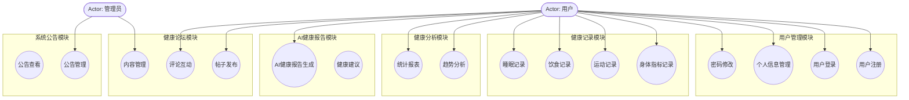

<objective>
Insert a detailed function module diagram into Section 3.2 (系统功能设计) of 毕业论文初稿.md. The diagram shows 6 main modules (用户管理, 健康记录, 健康分析, AI健康报告, 健康论坛, 系统公告) with 2-4 sub-components each, using Mermaid `graph TD` syntax with subgraphs.
</objective>

<execution_context>
@D:/SpringBoot-based-personal-health-center-system/.claude/get-shit-done/workflows/execute-plan.md
@D:/SpringBoot-based-personal-health-center-system/.claude/get-shit-done/templates/summary.md
</execution_context>

<context>
@.planning/PROJECT.md
@.planning/ROADMAP.md
@.planning/STATE.md
@.planning/phases/02-diagram-integration/02-CONTEXT.md
@.planning/phases/02-diagram-integration/02-RESEARCH.md
@毕业论文初稿.md
</context>

<tasks>

<task type="auto">
  <name>Task 1: Insert function module diagram in Section 3.2</name>
  <files>毕业论文初稿.md</files>
  <action>
Read 毕业论文初稿.md to confirm the exact line position for Section 3.2 (系统功能设计) which starts after the non-functional requirements section (ends around line 273). The section heading is "### 3.2 系统功能设计" at approximately line 274.

**Insertion point:** BEFORE the first paragraph of Section 3.2 content (before line 278 which begins "基于需求分析的结果，本系统设计了以下主要功能模块：").

**Caption to insert BEFORE the code block:**
```
**图3-2 系统功能模块图**
```

**Mermaid code to insert AFTER the caption:**


**IMPORTANT:** Follow the EXACT same pattern as the existing use case diagram (lines 225-258):
1. Caption line comes BEFORE the code block (blank line between)
2. Code block uses ```mermaid delimiters
3. Use `subgraph` to group modules
4. Use `((text))` for rounded rectangle nodes (sub-components)
5. Use `([Actor: name])` for actor nodes
6. Use `-->` for arrows connecting actors to use cases
</action>
  <verify>
<automated>grep -n "图3-2 系统功能模块图" "D:/SpringBoot-based-personal-health-center-system/毕业论文初稿.md" && grep -n "subgraph 用户管理模块" "D:/SpringBoot-based-personal-health-center-system/毕业论文初稿.md" && grep -n "subgraph 健康记录模块" "D:/SpringBoot-based-personal-health-center-system/毕业论文初稿.md"</automated>
  <done>Function module diagram (图3-2 系统功能模块图) appears in Section 3.2 with all 6 modules and their sub-components</done>
</task>

</tasks>

<threat_model>
## Trust Boundaries

N/A — documentation-only phase inserting Mermaid diagrams into existing thesis document.

## STRIDE Threat Register

| Threat ID | Category | Component | Disposition | Mitigation Plan |
|-----------|----------|-----------|------------|-----------------|
| T-02-01 | N/A | Documentation | accept | No security concerns for thesis diagram insertion |
</threat_model>

<verification>
grep -n "图3-2 系统功能模块图" 毕业论文初稿.md
grep -n "subgraph 用户管理模块" 毕业论文初稿.md
grep -n "subgraph 健康记录模块" 毕业论文初稿.md
grep -n "subgraph 健康分析模块" 毕业论文初稿.md
grep -n "subgraph AI健康报告模块" 毕业论文初稿.md
grep -n "subgraph 健康论坛模块" 毕业论文初稿.md
grep -n "subgraph 系统公告模块" 毕业论文初稿.md
</verification>

<success_criteria>
- [ ] **图3-2 系统功能模块图** caption appears in Section 3.2
- [ ] Mermaid code block contains `graph TD` syntax
- [ ] All 6 modules present as subgraphs: 用户管理模块, 健康记录模块, 健康分析模块, AI健康报告模块, 健康论坛模块, 系统公告模块
- [ ] Each module shows 2-4 sub-components
- [ ] Diagram uses same style as existing use case diagram (lines 225-258)
</success_criteria>

<output>
After completion, create `.planning/phases/02-diagram-integration/02-01-SUMMARY.md`
</output>
