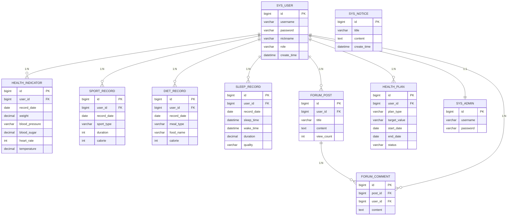
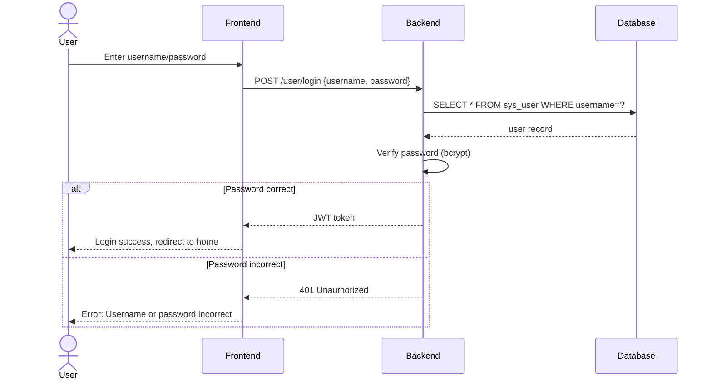
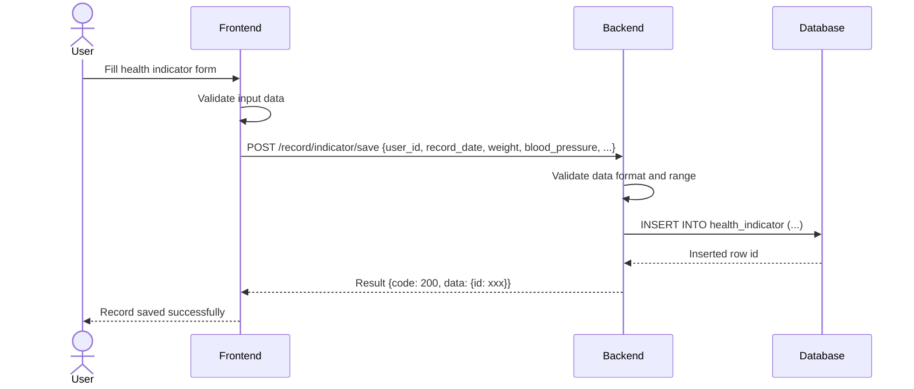
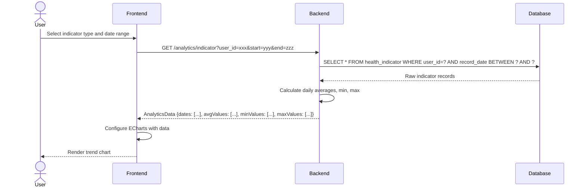

<objective>
Insert an ER diagram into Section 3.3 (数据库设计) and 3 sequence diagrams into Section 4.x (系统实现) of 毕业论文初稿.md. Diagrams use Mermaid erDiagram and sequenceDiagram syntax respectively.
</objective>

<execution_context>
@D:/SpringBoot-based-personal-health-center-system/.claude/get-shit-done/workflows/execute-plan.md
@D:/SpringBoot-based-personal-health-center-system/.claude/get-shit-done/templates/summary.md
</execution_context>

<context>
@.planning/PROJECT.md
@.planning/ROADMAP.md
@.planning/STATE.md
@.planning/phases/02-diagram-integration/02-CONTEXT.md
@.planning/phases/02-diagram-integration/02-RESEARCH.md
@毕业论文初稿.md
</context>

<tasks>

<task type="auto">
  <name>Task 1: Insert ER diagram in Section 3.3</name>
  <files>毕业论文初稿.md</files>
  <action>
Read 毕业论文初稿.md to find the exact insertion point for the ER diagram in Section 3.3 (数据库设计). Section 3.3 starts at line 314 with the heading "### 3.3 数据库设计".

**Insertion point:** AFTER the table definitions (after line 431 "### (9) 健康计划表（health_plan）" and its table), BEFORE the "---" separator at line 432.

**Caption to insert:**
```
**图3-3 系统ER图**
```

**Mermaid code to insert:**


**Note:** Per D-02 and D-03, all 9 entities must be included. The SYS_ADMIN entity is added for admin login (separate from regular sys_user) per the system's role-based design.
</action>
  <verify>
<automated>grep -n "图3-3 系统ER图" "D:/SpringBoot-based-personal-health-center-system/毕业论文初稿.md" && grep -n "SYS_USER ||--o{ HEALTH_INDICATOR" "D:/SpringBoot-based-personal-health-center-system/毕业论文初稿.md"</automated>
  <done>ER diagram (图3-3 系统ER图) appears in Section 3.3 with all 9 entities and relationships</done>
</task>

<task type="auto">
  <name>Task 2: Insert user login sequence diagram in Section 4.x</name>
  <files>毕业论文初稿.md</files>
  <action>
Find a suitable insertion point in Section 4.2 (后端接口实现, lines 474-507) — insert after the data format unified section (after line 506 "数据格式统一"), or in a new subsection if appropriate. The sequence diagrams should illustrate the flows described in Section 4.

**Caption to insert:**
```
**图4-1 用户登录时序图**
```

**Mermaid code to insert:**


**Insertion point:** In Section 4.2 (后端接口实现), before the Controller layer description section at line 478.
</action>
  <verify>
<automated>grep -n "图4-1 用户登录时序图" "D:/SpringBoot-based-personal-health-center-system/毕业论文初稿.md" && grep -n "sequenceDiagram" "D:/SpringBoot-based-personal-health-center-system/毕业论文初稿.md" | head -3</automated>
  <done>User login sequence diagram (图4-1 用户登录时序图) appears in Section 4.x</done>
</task>

<task type="auto">
  <name>Task 3: Insert health record creation sequence diagram</name>
  <files>毕业论文初稿.md</files>
  <action>
**Caption to insert:**
```
**图4-2 健康记录创建时序图**
```

**Mermaid code to insert:**


**Insertion point:** After the user login sequence diagram (Task 2), still in Section 4.2 or a new section.
</action>
  <verify>
<automated>grep -n "图4-2 健康记录创建时序图" "D:/SpringBoot-based-personal-health-center-system/毕业论文初稿.md" && grep -n "健康记录创建时序图" "D:/SpringBoot-based-personal-health-center-system/毕业论文初稿.md"</automated>
  <done>Health record creation sequence diagram (图4-2 健康记录创建时序图) appears in Section 4.x</done>
</task>

<task type="auto">
  <name>Task 4: Insert analytics data retrieval sequence diagram</name>
  <files>毕业论文初稿.md</files>
  <action>
**Caption to insert:**
```
**图4-3 健康数据分析时序图**
```

**Mermaid code to insert:**


**Insertion point:** After the health record creation sequence diagram (Task 3), still in Section 4.x.
</action>
  <verify>
<automated>grep -n "图4-3 健康数据分析时序图" "D:/SpringBoot-based-personal-health-center-system/毕业论文初稿.md" && grep -n "健康数据分析时序图" "D:/SpringBoot-based-personal-health-center-system/毕业论文初稿.md"</automated>
  <done>Analytics data retrieval sequence diagram (图4-3 健康数据分析时序图) appears in Section 4.x</done>
</task>

</tasks>

<threat_model>
## Trust Boundaries

N/A — documentation-only phase inserting Mermaid diagrams into existing thesis document.

## STRIDE Threat Register

| Threat ID | Category | Component | Disposition | Mitigation Plan |
|-----------|----------|-----------|------------|-----------------|
| T-02-02 | N/A | Documentation | accept | No security concerns for thesis diagram insertion |
</threat_model>

<verification>
# ER diagram checks
grep -n "图3-3 系统ER图" 毕业论文初稿.md
grep -n "SYS_USER ||--o{ HEALTH_INDICATOR" 毕业论文初稿.md
grep -n "FORUM_POST ||--o{ FORUM_COMMENT" 毕业论文初稿.md

# Sequence diagram checks
grep -n "图4-1 用户登录时序图" 毕业论文初稿.md
grep -n "图4-2 健康记录创建时序图" 毕业论文初稿.md
grep -n "图4-3 健康数据分析时序图" 毕业论文初稿.md
</verification>

<success_criteria>
- [ ] **图3-3 系统ER图** caption appears in Section 3.3
- [ ] ER diagram contains all 9 entities: sys_user, health_indicator, sport_record, diet_record, sleep_record, forum_post, forum_comment, sys_notice, health_plan
- [ ] ER diagram uses `erDiagram` syntax with `||--o{` Crow's foot notation
- [ ] **图4-1 用户登录时序图** appears in Section 4.x
- [ ] **图4-2 健康记录创建时序图** appears in Section 4.x
- [ ] **图4-3 健康数据分析时序图** appears in Section 4.x
- [ ] All sequence diagrams use `sequenceDiagram` with `actor` for human actors and `participant` for system components
- [ ] All captions use bold `**图X-N**` format before the code block
</success_criteria>

<output>
After completion, create `.planning/phases/02-diagram-integration/02-02-SUMMARY.md`
</output>
