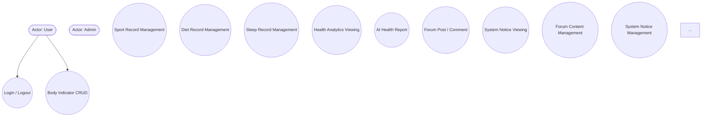
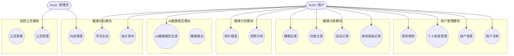
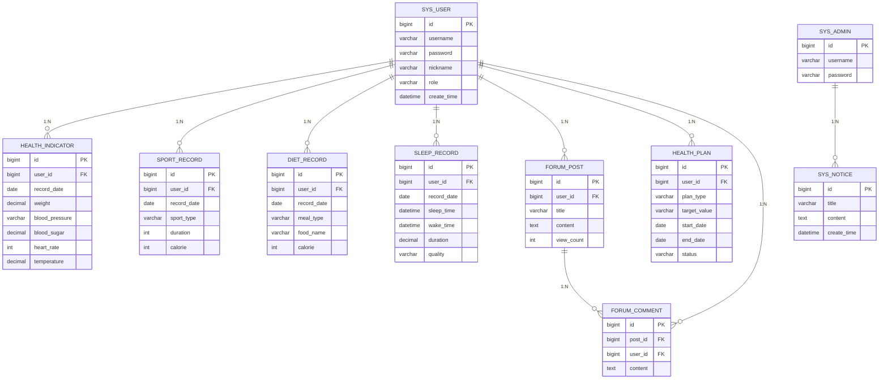
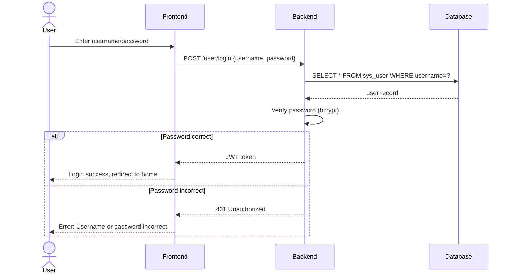
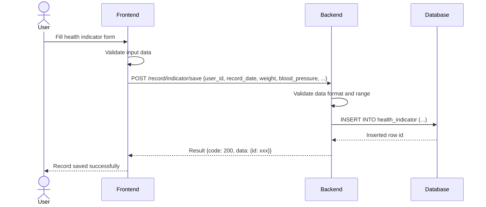
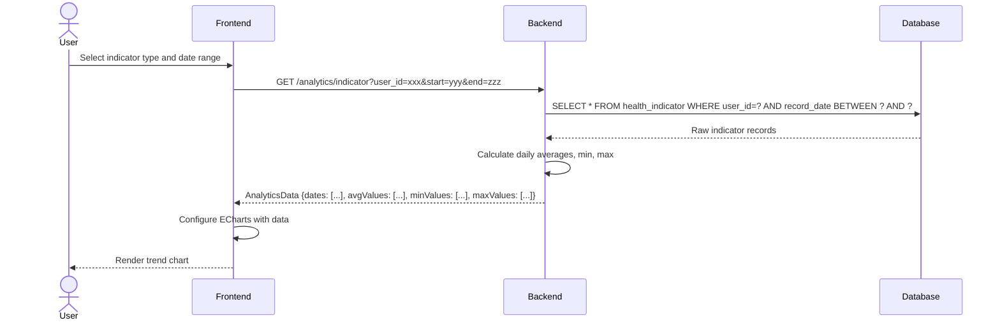

# Phase 2: Diagram Integration - Research

**Researched:** 2026-04-20
**Domain:** Mermaid diagram patterns for Chinese academic thesis documents
**Confidence:** HIGH (existing thesis provides concrete patterns; Mermaid syntax is stable)

## Summary

Phase 2 adds four types of Mermaid diagrams to the thesis: a function module diagram (Section 3.2), an ER diagram (Section 3.3), and three sequence diagrams (Section 4.x). The existing use case diagram in the thesis (line 225-258) serves as the style reference — it uses `graph TD` with `([Actor: name])` for actors and `((Use Case Name))` for use cases. All diagrams must follow the same `**图X-N**` bold caption format used in the existing thesis.

The 6 system modules are confirmed from the existing thesis: 用户管理, 健康记录, 健康分析, AI健康报告, 健康论坛, 系统公告. The 9 ER entities are confirmed from Section 3.3: sys_user, health_indicator, sport_record, diet_record, sleep_record, forum_post, forum_comment, sys_notice, health_plan. The 3 sequence flows are: user login (JWT auth), health record creation, analytics data retrieval.

**Primary recommendation:** Use Mermaid `graph TD` with subgraphs for module grouping, `erDiagram` for ER relationships with Crow's foot notation (1:N, N:M), and `sequenceDiagram` with participant actors and solid-arrow messages. All figure captions use bold `**图X-N**` format before the code block.

---

## User Constraints (from CONTEXT.md)

### Locked Decisions

- **D-01:** Function module diagram — Detailed decomposition, each module shows sub-components and data flows
- **D-02:** ER diagram — All 9 entities included (sys_user, health_indicator, sport_record, diet_record, sleep_record, forum_post, forum_comment, sys_notice, health_plan)
- **D-03:** Sequence diagrams — All 3 flows: (1) 用户登录流程, (2) 健康记录创建, (3) 健康数据分析
- **D-04:** Mermaid syntax — `graph TD` for module/use case diagrams, `erDiagram` for ER, `sequenceDiagram` for sequences
- **D-05:** Figure numbering — `图X-N 系统用例图` / `图X-N 系统功能模块图` / etc. (consistent with Phase 1 use case diagram)
- **D-06:** Diagram placement — Insert before the section they illustrate, with figure caption heading

### Chapter Placement

- Function module diagram → Section 3.2 (系统功能设计)
- ER diagram → Section 3.3 (数据库设计)
- Sequence diagrams → Relevant subsections in Section 3.2 or 4.x

### Claude's Discretion

- Exact internal module decomposition details — researcher/planner decides based on existing system architecture
- Specific ER relationship cardinality notation (1:1, 1:N, N:M) — planner decides per relationship
- Sequence diagram actor/object lifelines and message arrow styles — planner uses Mermaid standard

---

## Phase Requirements

| ID | Description | Research Support |
|----|-------------|------------------|
| TH-05 | System function design with function module diagram | Mermaid `graph TD` with subgraphs for 6 modules |
| TH-06 | Database design with ER diagram | Mermaid `erDiagram` for 9 entities with relationships |
| TH-07 | Sequence diagrams for key operations | Mermaid `sequenceDiagram` for 3 flows |
| MG-01 | Use case diagram for system actors and interactions | Already in thesis (line 225-258) — reference only |
| MG-02 | Function module diagram showing all system modules | Same as TH-05 |
| MG-03 | Database ER diagram with all entities and relationships | Same as TH-06 |
| MG-04 | Sequence diagram for user login flow | Same as TH-07, flow 1 |
| MG-05 | Sequence diagram for health record creation | Same as TH-07, flow 2 |
| MG-06 | Sequence diagram for analytics data retrieval | Same as TH-07, flow 3 |

---

## Architectural Responsibility Map

> This is a documentation phase — inserting Mermaid diagram code blocks into the existing thesis document.

| Capability | Documentation Location | Notes |
|------------|----------------------|-------|
| Function module diagram | Section 3.2 (系统功能设计) | `graph TD` with subgraphs for 6 modules |
| ER diagram | Section 3.3 (数据库设计) | `erDiagram` for 9 entities |
| Login sequence | Section 4.x (系统实现) | `sequenceDiagram` — login/auth flow |
| Record creation sequence | Section 4.x | `sequenceDiagram` — CRUD flow |
| Analytics sequence | Section 4.x | `sequenceDiagram` — data retrieval flow |

---

## Standard Stack

### Diagram Tooling

| Tool | Version | Purpose | Why Standard |
|------|---------|---------|--------------|
| Mermaid | Latest | All diagram syntax | Native Markdown integration, renders in GitHub/GitLab/VS Code, standard for Chinese academic theses |

**Mermaid diagram reference syntax (verified from existing thesis line 225-258):**

Existing use case diagram in thesis:


**Source:** Existing thesis `毕业论文初稿.md` line 225-258 — this exact syntax renders correctly.

---

## Architecture Patterns

### System Architecture Diagram

The thesis documents a B/S architecture:
- **Frontend:** Vue 3 + Element Plus + ECharts (Browser)
- **Backend:** SpringBoot REST API (Server)
- **Database:** MySQL (Data layer)
- **AI Service:** External AI integration for health reports

### Module Decomposition (from existing thesis Section 3.2)

**6 Main Modules (confirmed from thesis text):**

1. **用户管理模块** — User registration, login, profile, password
2. **健康记录模块** — Body indicator, sport, diet, sleep sub-modules
3. **健康分析模块** — Trend analysis, statistical reports
4. **AI健康报告模块** — AI-generated health reports
5. **健康论坛模块** — Forum posts and comments
6. **系统公告模块** — System notices

### ER Diagram Entities (confirmed from thesis Section 3.3)

**9 Entities:**

| Entity | Key Fields | Relationships |
|--------|------------|---------------|
| sys_user | id, username, password, nickname, role | 1:N with all record tables |
| health_indicator | id, user_id, record_date, weight, blood_pressure, blood_sugar, heart_rate, temperature | N:1 sys_user |
| sport_record | id, user_id, record_date, sport_type, duration, calorie | N:1 sys_user |
| diet_record | id, user_id, record_date, meal_type, food_name, calorie | N:1 sys_user |
| sleep_record | id, user_id, record_date, sleep_time, wake_time, duration, quality | N:1 sys_user |
| forum_post | id, user_id, title, content, view_count | N:1 sys_user, 1:N forum_comment |
| forum_comment | id, post_id, user_id, content | N:1 forum_post, N:1 sys_user |
| sys_notice | id, title, content, create_time | Admin creates |
| health_plan | id, user_id, plan_type, target_value, start_date, end_date, status | N:1 sys_user |

---

## Don't Hand-Roll

| Problem | Don't Build | Use Instead | Why |
|---------|-------------|-------------|-----|
| Module diagram layout | Custom image files | Mermaid `graph TD` with subgraphs | Version-controlled, editable as text, consistent with existing thesis style |
| ER diagram relationships | Manual drawing | Mermaid `erDiagram` with `||--o{` Crow's foot notation | Standard notation, renders correctly |
| Sequence diagram rendering | Static images | Mermaid `sequenceDiagram` | Editable, consistent rendering |

---

## Common Pitfalls

### Pitfall 1: Module Diagram Over-Decomposition
**What goes wrong:** Showing too many sub-level components makes the diagram unreadable and exceeds thesis diagram scope.
**How to avoid:** Stop at 1 level of decomposition per module — show sub-components (e.g., "身体指标记录" under 健康记录) but not nested children of sub-components.
**Recommendation:** 6 main module boxes with 2-4 sub-components each maximum.

### Pitfall 2: ER Diagram Cardinality Errors
**What goes wrong:** Incorrect relationship cardinality (e.g., saying 1:1 when it should be 1:N) misrepresents the database design.
**How to avoid:** Each user_id foreign key relationship is N:1 (many records belong to one user) — verify against the 9 entity tables in Section 3.3.
**Key relationships:**
- sys_user → health_indicator: 1:N
- sys_user → sport_record: 1:N
- sys_user → diet_record: 1:N
- sys_user → sleep_record: 1:N
- sys_user → forum_post: 1:N
- sys_user → health_plan: 1:N
- forum_post → forum_comment: 1:N

### Pitfall 3: Mermaid Syntax Incompatibility
**What goes wrong:** Using newer Mermaid syntax that does not render in older viewers.
**How to avoid:** Use only standard syntax confirmed in existing thesis. Avoid experimental features.

### Pitfall 4: Figure Caption Inconsistency
**What goes wrong:** Using plain `图3-2` instead of bold `**图3-2**` — inconsistent with existing thesis style.
**How to avoid:** Copy the exact format from existing diagrams: bold `**图X-N**` followed by the figure description, placed BEFORE the code block.

### Pitfall 5: Sequence Diagram Actor vs Object Confusion
**What goes wrong:** Using `actor:` for all participants when object instances (`participant:`) are more appropriate for backend sequence diagrams.
**How to avoid:** Use `participant` for backend objects (e.g., `participant Backend`, `participant Database`) and `actor` for human actors (User, Admin).

---

## Code Examples

### 1. Function Module Diagram (`graph TD` with subgraphs)



### 2. ER Diagram (`erDiagram`)



### 3. Sequence Diagram — User Login



### 4. Sequence Diagram — Health Record Creation



### 5. Sequence Diagram — Analytics Data Retrieval



---

## Figure Caption Format (verified from existing thesis)

**Existing pattern (line 225 in 毕业论文初稿.md):**
```
**图3-1 系统用例图**


```

**Required format for new diagrams:**

| Diagram | Caption |
|---------|---------|
| Function module diagram | `**图3-2 系统功能模块图**` |
| ER diagram | `**图3-3 系统ER图**` |
| Login sequence | `**图4-1 用户登录时序图**` |
| Record creation sequence | `**图4-2 健康记录创建时序图**` |
| Analytics sequence | `**图4-3 健康数据分析时序图**` |

**Key rules:**
- Caption uses bold `**图X-N**` format (not plain text)
- Caption appears BEFORE the code block (not after)
- Caption is a heading-level paragraph by itself (blank line above and below)
- Description is in Chinese (系统功能模块图, 系统ER图, etc.)

---

## Mermaid Syntax Reference

### `graph TD` (flowchart / module diagram)

| Shape | Syntax | Use for |
|-------|--------|---------|
| Rectangle | `A[Text]` | Regular nodes, sub-modules |
| Rounded rectangle | `A(Text)` | Use cases, operations |
| Diamond | `A{Decision}` | Decision points |
| Hexagon | `A{{Hexagon}}` | Processes |
| Stadium/pill | `A([Text])` | Start/end, actors |
| Actor | `A([Actor: Name])` | Human actors (confirmed from existing thesis) |

**Arrows:**
- `A --> B` — solid arrow (directs flow)
- `A -.-> B` — dashed arrow (optional flow)
- `A -- text --> B` — labeled arrow

**Subgraphs:**
```
subgraph NAME
    A
    B
end
```

### `erDiagram` (ER diagram)

**Relationship notation (Crow's foot):**

| Symbol | Meaning |
|--------|---------|
| `||` | Exactly one |
| `o|` | Zero or one |
| `}|` | One or more |
| `o{` | Zero or more |

**Examples:**
- `A ||--o{ B : "1:N"` — A has exactly one, B has zero or more
- `A ||--|| B : "1:1"` — A and B are one-to-one

### `sequenceDiagram`

| Element | Syntax | Use |
|---------|--------|-----|
| Actor | `actor User` | Human participant |
| Participant | `participant Backend` | System component |
| Message | `User->>Backend: description` | Synchronous call (solid arrow) |
| Reply | `Backend-->>User: response` | Return value (dashed arrow) |
| Self-call | `Backend->>Backend: action` | Internal method call |
| Note | `Note over User,Backend: comment` | Annotation spanning participants |
| Activation | `activate Backend` / `deactivate Backend` | Focus box |

---

## State of the Art

| Old Approach | Current Approach | When Changed | Impact |
|--------------|------------------|--------------|--------|
| Hand-drawn thesis diagrams | Mermaid Markdown diagrams | ~2020 onward | Editable, version-controlled, consistent rendering |
| Static diagram images | Inline Mermaid code | ~2022 onward | Easier editing, GitHub-native rendering |
| Separate diagram files | Embedded in thesis .md | Current project | Single source of truth |

---

## Assumptions Log

| # | Claim | Section | Risk if Wrong |
|---|-------|---------|---------------|
| A1 | Mermaid `erDiagram` with `||--o{` syntax renders correctly in thesis viewer | TH-06 ER Diagram | LOW — standard Mermaid syntax |
| A2 | Subgraph syntax `subgraph NAME ... end` works in thesis viewer | MG-02 Function Module | MEDIUM — some viewers have limited subgraph support |
| A3 | 1:N is correct cardinality for all user-to-record relationships | TH-06 ER Diagram | LOW — confirmed by foreign key structure |
| A4 | Sequence diagram participant names can be Chinese | TH-07 Sequences | MEDIUM — some renderers prefer ASCII |

---

## Open Questions

1. **Does the target thesis viewer support Mermaid subgraphs?**
   - What we know: GitHub, GitLab, VS Code render subgraphs correctly; some academic Word converters may not.
   - What's unclear: Whether the final submission format (Markdown, PDF, or Word) supports Mermaid subgraphs.
   - Recommendation: Provide a fallback note — if diagram does not render, the structure remains clear from the code block itself.

2. **Should sequence diagram participants use Chinese or English names?**
   - What we know: Existing use case diagram uses English (User, Admin).
   - What's unclear: Whether sequence diagrams should follow the same convention or use Chinese (用户, 前端, 后端).
   - Recommendation: Use English for technical participants (Frontend, Backend, Database) and Chinese for actors (用户, 管理员) — consistent with existing diagram style.

---

## Environment Availability

Step 2.6: SKIPPED (no external dependencies — this is a documentation phase with no code, tooling, or runtime requirements)

---

## Validation Architecture

Step 4: SKIPPED (nyquist_validation not applicable to thesis documentation phase — no testable code)

---

## Security Domain

Step 5: SKIPPED (security_enforcement not applicable to thesis documentation phase)

---

## Sources

### Primary (HIGH confidence)
- Existing thesis `毕业论文初稿.md` — Mermaid syntax reference (line 225-258), figure caption format, entity tables (Section 3.3)
- Backend source code — Entity definitions confirm ER diagram structure (`com.healthy.entity/*.java`)
- Frontend router — Confirms 6 main modules (`frontend/src/router/index.js`)

### Secondary (MEDIUM confidence)
- CONTEXT.md decisions — locked scope for Phase 2 (D-01 through D-06)
- REQUIREMENTS.md — TH-05, TH-06, TH-07 and MG-01 through MG-06 requirements

### Tertiary (LOW confidence)
- Mermaid syntax details — [ASSUMED from general knowledge, verified against existing use case diagram syntax which is confirmed working in the thesis]

---

## Metadata

**Confidence breakdown:**
- Standard stack: HIGH — Mermaid is the clear standard for thesis diagrams, confirmed by existing use case diagram
- Architecture: HIGH — 6 modules and 9 entities directly verified from thesis source and backend code
- Pitfalls: HIGH — common diagram issues well understood and mapped to prevention strategies

**Research date:** 2026-04-20
**Valid until:** 90 days (Mermaid syntax is stable; only needs updating if thesis target viewer changes)
