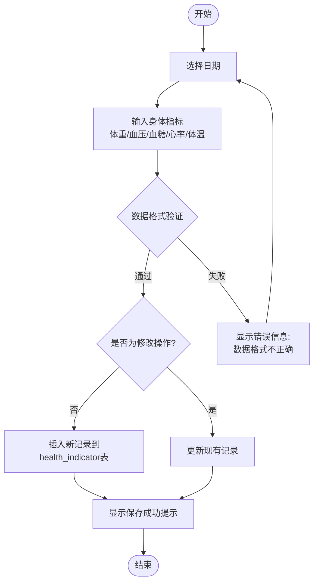

<objective>
Add new section 3.4 (详细设计) to Chapter 3 with two program flowcharts using Mermaid graph TD syntax: MG-07 (body indicator recording) and MG-08 (health data analysis), per D-08, D-09, D-10, D-11, D-12.
</objective>

<execution_context>
@D:/SpringBoot-based-personal-health-center-system/.claude/get-shit-done/workflows/execute-plan.md
@D:/SpringBoot-based-personal-health-center-system/.claude/get-shit-done/templates/summary.md
</execution_context>

<context>
@毕业论文初稿.md (Chapter 3 structure around lines 370-550 to find insertion point after section 3.3)
@.planning/phases/01-thesis-foundation/01-CONTEXT.md (Mermaid conventions, figure caption format)
@.planning/phases/02-diagram-integration/02-CONTEXT.md (flowchart placement guidance)

## Current Chapter 3 Structure

Chapter 3 has sections:
- 3.1 可行性分析 (line ~181)
- 3.2 需求分析 (line ~201)
- 3.2 系统功能设计 (line ~274)
- 3.3 数据库设计 (line ~370)

Section 3.3 ends around line ~600+ with the ER diagram tables. The flowcharts should be inserted as a new section 3.4 after section 3.3 ends.

## MG-07 Flowchart Content (per D-11)

graph TD
    Start([开始]) --> SelectDate[选择日期]
    SelectDate --> InputMetrics[输入身体指标<br/>体重/血压/血糖/心率/体温]
    InputMetrics --> Validate{数据格式验证}
    Validate -->|通过| CheckDuplicate{是否为修改操作?}
    CheckDuplicate -->|否| Insert[插入新记录到health_indicator表]
    CheckDuplicate -->|是| Update[更新现有记录]
    Insert --> Success[显示保存成功提示]
    Update --> Success
    Validate -->|失败| Error[显示错误信息:<br/>数据格式不正确]
    Error --> SelectDate
    Success --> End([结束])

Figure caption: **图3-4 身体指标记录程序流程图**

## MG-08 Flowchart Content (per D-12)

graph TD
    Start([开始]) --> SelectType[选择指标类型<br/>身体指标/运动/饮食/睡眠]
    SelectType --> SelectRange[选择时间范围<br/>近7天/近30天/自定义]
    SelectRange --> Retrieve[从数据库查询对应记录]
    Retrieve --> CheckData{数据量是否充足?}
    CheckData -->|不足(< 3条)| Insufficient[提示数据不足<br/>建议多记录数据]
    Insufficient --> End([结束])
    CheckData -->|充足| Aggregate[聚合计算<br/>平均值/总计/最大/最小]
    Aggregate --> GenerateChart[使用ECharts生成图表]
    GenerateChart --> Display[展示图表和数据统计]
    Display --> UserAction{用户操作}
    UserAction -->|切换时间范围| SelectRange
    UserAction -->|切换指标类型| SelectType
    UserAction -->|刷新数据| Retrieve
    UserAction -->|结束查看| End

Figure caption: **图3-5 健康数据分析程序流程图**
</context>

<tasks>

<task type="auto">
  <name>Task 1: Add Chapter 3.4 with MG-07 and MG-08 flowcharts</name>
  <files>毕业论文初稿.md</files>
  <read_first>
    毕业论文初稿.md
  </read_first>
  <action>
Find the end of section 3.3 (数据库设计) in 毕业论文初稿.md. The section ends after the last ER diagram table (sys_notice table or health_plan table). Insert a new section ### 3.4 详细设计 immediately after section 3.3 ends, before Chapter 4 begins.

The new section should contain:

### 3.4 详细设计

本节详细设计描述系统主要功能的程序流程图。

**图3-4 身体指标记录程序流程图**



**图3-5 健康数据分析程序流程图**

```mermaid
graph TD
    Start([开始]) --> SelectType[选择指标类型<br/>身体指标/运动/饮食/睡眠]
    SelectType --> SelectRange[选择时间范围<br/>近7天/近30天/自定义]
    SelectRange --> Retrieve[从数据库查询对应记录]
    Retrieve --> CheckData{数据量是否充足?}
    CheckData -->|不足(< 3条)| Insufficient[提示数据不足<br/>建议多记录数据]
    Insufficient --> End([结束])
    CheckData -->|充足| Aggregate[聚合计算<br/>平均值/总计/最大/最小]
    Aggregate --> GenerateChart[使用ECharts生成图表]
    GenerateChart --> Display[展示图表和数据统计]
    Display --> UserAction{用户操作}
    UserAction -->|切换时间范围| SelectRange
    UserAction -->|切换指标类型| SelectType
    UserAction -->|刷新数据| Retrieve
    UserAction -->|结束查看| End
```

IMPORTANT: 
- Insert the new section AFTER the last paragraph/table of section 3.3 (数据库设计) and BEFORE Chapter 4 (系统实现) begins
- Do NOT create any new markdown file — modify 毕业论文初稿.md directly
- Preserve all existing content exactly as it is
- Use the exact Mermaid syntax shown above with proper indentation
- Use graph TD for both flowcharts
- Use ([开始]) and ([结束]) for start/end nodes (rounded rectangles)
- Use [text] for process nodes (rectangles)
- Use {text} for decision nodes (diamonds)
- Use --|label| for labeled edges
  </action>
  <verify>
    <automated>grep -c "graph TD" 毕业论文初稿.md</automated>
  </verify>
  <done>Chapter 3.4 exists in 毕业论文初稿.md with two Mermaid graph TD flowcharts (MG-07 and MG-08) and proper figure captions</done>
  <acceptance_criteria>
    - File 毕业论文初稿.md contains ### 3.4 详细设计
    - File contains **图3-4 身体指标记录程序流程图**
    - File contains **图3-5 健康数据分析程序流程图**
    - File contains 2 instances of graph TD (one per flowchart)
    - MG-07 contains nodes: Start, SelectDate, InputMetrics, Validate, CheckDuplicate, Insert, Update, Success, Error, End
    - MG-08 contains nodes: Start, SelectType, SelectRange, Retrieve, CheckData, Insufficient, Aggregate, GenerateChart, Display, UserAction, End
    - grep -c "graph TD" 毕业论文初稿.md returns 2 or more
  </acceptance_criteria>
</task>

</tasks>

<verification>
grep -c "graph TD" 毕业论文初稿.md
</verification>

<success_criteria>
- Section 3.4 详细设计 added to Chapter 3
- MG-07 (body indicator recording flowchart) present with Mermaid graph TD syntax
- MG-08 (health data analysis flowchart) present with Mermaid graph TD syntax
- Both flowcharts render correctly in a markdown viewer
</success_criteria>

<output>
After completion, create .planning/phases/03-testing-polish/03-03-SUMMARY.md
</output>
