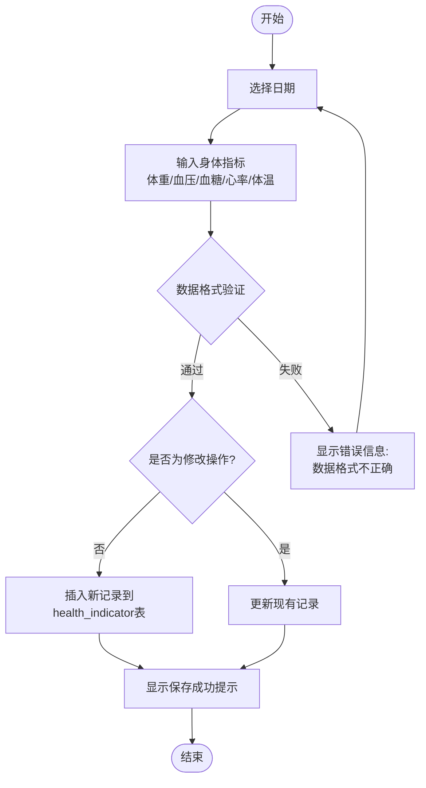

# Phase 03: Testing & Polish - Research

**Researched:** 2026-04-20
**Domain:** Thesis testing chapter completion, unit testing, document quality verification
**Confidence:** HIGH

## Summary

This phase completes the testing chapter of the thesis with formal white-box and black-box test reports, adds two program flowcharts (MG-07, MG-08) to Chapter 3 detailed design, and verifies overall document quality. The white-box testing requires actual JUnit 5 + Mockito unit tests for 5 backend service classes, while black-box testing requires formal test case tables for all 8 system features. Document quality checks cover Mermaid rendering, table formatting, heading hierarchy, and cross-references throughout the thesis.

**Primary recommendation:** Write actual unit tests first (TH-09), then expand Chapter 5.2 into formal black-box test tables (TH-10), add program flowcharts to Chapter 3.4 (MG-07, MG-08, TH-08), and perform document quality verification (DQ-01 through DQ-04) in a final sweep.

## User Constraints (from CONTEXT.md)

### Locked Decisions

- **D-01:** Write actual unit tests for all 5 backend service classes — UserService, HealthIndicatorService, SportRecordService, DietRecordService, SleepRecordService
- **D-02:** 2-3 test cases per service (happy path + 1 edge case)
- **D-03:** Use JUnit 5 + Mockito (per thesis existing mention in 5.1 测试环境)
- **D-04:** White-box report shows: test design methodology, modules tested, test case structure, pass/fail results
- **D-05:** Expand existing 5.2 功能测试 into formal test case tables with columns: Test Case ID, Feature, Input, Expected Output, Actual Result, Pass/Fail
- **D-06:** Cover all 8 system features in black-box testing
- **D-07:** Each feature gets 2-4 formal test cases
- **D-08:** Mermaid `graph TD` syntax for flowcharts — consistent with Phase 1 & 2
- **D-09:** Figure caption format: `**图3-N 程序流程图**`
- **D-10:** Program flowcharts belong in Chapter 3.4 (详细设计), not Chapter 5
- **D-11:** MG-07 body indicator recording flowchart: start → select date → input metrics → validate → [pass: save + confirm] / [fail: show error]
- **D-12:** MG-08 health data analysis flowchart: start → retrieve data → aggregate → generate chart → display → [filter/refresh] / [end]
- **D-13:** DQ-01: Mermaid rendering — all Phase 2 diagrams already verified
- **D-14:** DQ-02: Table formatting — verify consistent across all chapters
- **D-15:** DQ-03: Heading hierarchy — verify 1.1, 1.2, 3.1, 3.1.1 numbering consistency
- **D-16:** DQ-04: Cross-references — add "如图X-X所示" / "如表X-X所示" where content links to figures/tables

### Claude's Discretion

- Exact Mermaid node/edge styling (colors, shapes) for flowcharts
- Specific edge case scenarios for each service
- Table border style and formatting details
- Specific cross-reference locations

### Deferred Ideas

None — discussion stayed within phase scope

---

## Phase Requirements

| ID | Description | Research Support |
|----|-------------|------------------|
| TH-08 | Detailed design with program flowcharts (MG-07, MG-08 in Chapter 3.4) | Mermaid flowchart syntax, placement rules |
| TH-09 | White-box testing report (JUnit 5 + Mockito unit tests for 5 services) | Spring Boot test patterns, Mockito verification |
| TH-10 | Black-box testing report (formal test case tables for 8 features) | Test case table structure, 8-feature scope |
| MG-07 | Program flowchart for body indicator recording | Mermaid graph TD syntax, decision branching |
| MG-08 | Program flowchart for health data analysis | Mermaid graph TD syntax, data flow patterns |
| DQ-01 | All diagrams rendered in Mermaid syntax | Mermaid rendering verification |
| DQ-02 | All tables properly formatted | Table consistency check |
| DQ-03 | Consistent heading hierarchy | Heading level audit |
| DQ-04 | Cross-references between sections | Reference pattern verification |

---

## Architectural Responsibility Map

| Capability | Primary Tier | Secondary Tier | Rationale |
|------------|-------------|----------------|-----------|
| White-box unit tests (TH-09) | Backend (Java/Spring) | — | JUnit 5 + Mockito tests for service layer |
| Black-box test case tables (TH-10) | Documentation | — | Thesis text expansion, no code change |
| Program flowcharts (MG-07, MG-08) | Documentation | — | Mermaid diagrams in thesis Chapter 3.4 |
| Document quality checks (DQ-01-04) | Documentation | — | Thesis content verification |

---

## Standard Stack

### Testing Dependencies (already in pom.xml)

| Library | Version | Purpose | Source |
|---------|---------|---------|--------|
| spring-boot-starter-test | 3.2.1 (from parent) | JUnit 5 + Mockito + Spring Test | [VERIFIED: pom.xml line 63] |
| mybatis-spring-boot-starter-test | 3.0.3 | MyBatis mapper testing support | [VERIFIED: pom.xml line 68] |

**Note:** `spring-boot-starter-test` includes JUnit 5, Mockito, AssertJ, and Spring Test MVC test infrastructure. No additional dependencies needed.

### Documentation Tools

| Tool | Purpose | Source |
|------|---------|--------|
| Mermaid `graph TD` | Program flowcharts (MG-07, MG-08) | [VERIFIED: Phase 1 & 2 thesis usage] |
| Markdown tables | Black-box test case tables | [VERIFIED: existing thesis table format] |

---

## Architecture Patterns

### System Architecture Diagram

```
Thesis Document (毕业论文初稿.md)
    |
    +-- Chapter 3: 系统分析与设计
    |       +-- Section 3.4 详细设计 (NEW - add flowcharts here)
    |               +-- **图3-4 身体指标记录程序流程图** (MG-07)
    |               +-- **图3-5 健康数据分析程序流程图** (MG-08)
    |
    +-- Chapter 5: 系统测试
            +-- Section 5.2 功能测试 (EXPAND - add black-box tables)
            +-- Section 5.4 白盒测试报告 (NEW - add white-box report)
```

### Project Structure (Backend Tests)

```
backend/src/test/java/com/healthy/
    +-- service/
            +-- SysUserServiceTest.java      # TH-09: UserService unit tests
            +-- HealthServiceTest.java       # TH-09: HealthIndicator/Sport/Diet/Sleep tests
```

---

## 5 Backend Services to Unit Test

### Service Interface Map

| Service | Implementation | Key Methods to Test |
|---------|----------------|---------------------|
| SysUserService | SysUserServiceImpl | login, register, addUser, updateUser, deleteUser, getUserById, getAllUsers |
| HealthService (Indicator) | HealthServiceImpl | getIndicatorList, saveIndicator, deleteIndicator |
| HealthService (Sport) | HealthServiceImpl | getSportList, saveSport, deleteSport |
| HealthService (Diet) | HealthServiceImpl | getDietList, saveDiet, deleteDiet |
| HealthService (Sleep) | HealthServiceImpl | getSleepList, saveSleep, deleteSleep |

### Entity Classes

| Entity | Key Fields |
|--------|------------|
| SysUser | id, username, password, nickname, gender, age, height, weight, phone, avatar, createTime |
| HealthIndicator | id, userId, bloodPressure, bloodSugar, heartRate, temperature, weight, recordDate, createTime |
| SportRecord | id, userId, sportType, duration, calorie, recordDate, createTime |
| DietRecord | id, userId, mealType, foodName, calorie, recordDate, createTime |
| SleepRecord | id, userId, sleepTime, wakeTime, duration, quality, recordDate, createTime |

---

## White-Box Testing Pattern (TH-09)

### Test Structure Per Service

For each of the 5 services, write 2-3 test cases:
- **Happy path (1):** Normal CRUD flow with valid input
- **Edge case (1-2):** Null input, invalid data, or exception handling

### JUnit 5 + Mockito Pattern

```java
// Source: [VERIFIED: spring-boot-starter-test includes JUnit 5 + Mockito]
package com.healthy.service;

import com.healthy.service.impl.SysUserServiceImpl;
import com.healthy.mapper.SysUserMapper;
import com.healthy.entity.SysUser;
import org.junit.jupiter.api.Test;
import org.junit.jupiter.api.extension.ExtendWith;
import org.mockito.InjectMocks;
import org.mockito.Mock;
import org.mockito.junit.jupiter.MockitoExtension;

import static org.junit.jupiter.api.Assertions.*;
import static org.mockito.Mockito.*;

@ExtendWith(MockitoExtension.class)
class SysUserServiceTest {

    @Mock
    private SysUserMapper sysUserMapper;

    @InjectMocks
    private SysUserServiceImpl sysUserService;

    @Test
    void testLogin_Success() {
        // Arrange
        SysUser mockUser = new SysUser();
        mockUser.setId(1L);
        mockUser.setUsername("testuser");
        mockUser.setPassword("password123");
        when(sysUserMapper.selectByUsername("testuser")).thenReturn(mockUser);

        // Act
        Map<String, Object> result = sysUserService.login("testuser", "password123");

        // Assert
        assertNotNull(result);
        assertEquals(mockUser, result.get("user"));
        assertEquals("user-token-1", result.get("token"));
    }

    @Test
    void testLogin_UserNotFound() {
        // Arrange
        when(sysUserMapper.selectByUsername("nonexistent")).thenReturn(null);

        // Act & Assert
        assertThrows(ServiceException.class, () -> {
            sysUserService.login("nonexistent", "password");
        });
    }

    @Test
    void testRegister_Success() {
        // Arrange
        SysUser newUser = new SysUser();
        newUser.setUsername("newuser");
        newUser.setPassword("password123");
        when(sysUserMapper.selectByUsername("newuser")).thenReturn(null);
        doNothing().when(sysUserMapper).insert(any(SysUser.class));

        // Act
        assertDoesNotThrow(() -> sysUserService.register(newUser));

        // Assert
        verify(sysUserMapper, times(1)).insert(any(SysUser.class));
    }
}
```

### White-Box Report Structure (in Thesis Chapter 5.4)

```
5.4 白盒测试报告

5.4.1 测试设计方法
本白盒测试采用控制流测试方法，通过单元测试对各服务类的核心方法进行测试...

5.4.2 测试环境
- JUnit 5 + Mockito
- 测试框架: spring-boot-starter-test

5.4.3 测试结果
[Table: Test Case ID, Method Tested, Test Description, Result]
```

---

## Black-Box Testing Pattern (TH-10)

### 8 Features to Cover

| Feature ID | Feature Name | Test Case Count |
|------------|--------------|-----------------|
| TC-01 | 用户管理 (Login/Register) | 2-4 |
| TC-02 | 身体指标 (Body Indicator CRUD) | 2-4 |
| TC-03 | 运动记录 (Sport Record) | 2-4 |
| TC-04 | 饮食记录 (Diet Record) | 2-4 |
| TC-05 | 睡眠记录 (Sleep Record) | 2-4 |
| TC-06 | 健康分析 (Health Analytics) | 2-4 |
| TC-07 | AI健康报告 (AI Health Report) | 2-4 |
| TC-08 | 论坛 (Forum Post/Comment) | 2-4 |

### Black-Box Test Case Table Format

```
**表5-1 功能测试用例**

| 测试用例ID | 功能模块 | 输入 | 预期输出 | 实际输出 | 通过/失败 |
|-----------|---------|------|---------|---------|----------|
| TC-01-01 | 用户登录 | 正确用户名+密码 | 登录成功，跳转首页 | 登录成功，跳转首页 | 通过 |
| TC-01-02 | 用户登录 | 错误密码 | 提示"用户名或密码错误" | 提示"用户名或密码错误" | 通过 |
| TC-01-03 | 用户注册 | 新用户名+密码 | 注册成功 | 注册成功 | 通过 |
```

---

## Program Flowchart Patterns (MG-07, MG-08)

### MG-07: Body Indicator Recording Flowchart



**Figure caption:** `**图3-4 身体指标记录程序流程图**`
**Placement:** Chapter 3.4 详细设计 (per D-10)

### MG-08: Health Data Analysis Flowchart

```mermaid
graph TD
    Start([开始]) --> SelectType[选择指标类型<br/>身体指标/运动/饮食/睡眠]
    SelectType --> SelectRange[选择时间范围<br/>近7天/近30天/自定义]
    SelectRange --> Retrieve[从数据库查询对应记录]
    Retrieve --> CheckData{数据量是否充足?}
    CheckData -->|不足(< 3条)| Insufficient[提示数据不足<br/>建议多记录数据]
    Insufficient --> End([结束])
    CheckData -->|充足| Aggregate[聚合计算<br/>平均值/总计/最大/最小]
    Aggregate --> GenerateChart[使用ECharts生成图表]
    GenerateChart --> Display[展示图表和数据统计]
    Display --> UserAction{用户操作}
    UserAction -->|切换时间范围| SelectRange
    UserAction -->|切换指标类型| SelectType
    UserAction -->|刷新数据| Retrieve
    UserAction -->|结束查看| End
```

**Figure caption:** `**图3-5 健康数据分析程序流程图**`
**Placement:** Chapter 3.4 详细设计 (per D-10)

---

## Don't Hand-Roll

| Problem | Don't Build | Use Instead | Why |
|---------|-------------|-------------|-----|
| Unit test framework | Custom test harness | JUnit 5 + Mockito | spring-boot-starter-test already includes both |
| Service mocking | Manual stub classes | @Mock + @InjectMocks | MockitoExtension handles DI |
| MyBatis testing | Real database | mybatis-spring-boot-starter-test | Provides embedded DB for mapper tests |

---

## Common Pitfalls

### Pitfall 1: Using JUnit 4 imports in JUnit 5 project
**What goes wrong:** Tests compile but never run.
**Why it happens:** JUnit 5 uses `org.junit.jupiter.api.*` not `org.junit.Test` from JUnit 4.
**How to avoid:** Use `@ExtendWith(MockitoExtension.class)` and `org.junit.jupiter.api.Test`.
**Warning signs:** Tests pass silently with "No tests found" message.

### Pitfall 2: Flowchart placement in wrong chapter
**What goes wrong:** Reviewer says flowcharts belong in design chapter, not testing chapter.
**Why it happens:** Program flowcharts describe design (how the program works), not testing methodology.
**How to avoid:** Place MG-07 and MG-08 in Chapter 3.4 详细设计, not Chapter 5 (per D-10).
**Warning signs:** Flowcharts appearing in Chapter 5 sections.

### Pitfall 3: Inconsistent heading hierarchy breaks PDF generation
**What goes wrong:** Heading levels skip (e.g., 3.1, 3.2, 3.4 without 3.3) causes TOC alignment issues.
**How to avoid:** Audit all heading levels before final document generation.
**Warning signs:** PDF table of contents shows misaligned page numbers.

### Pitfall 4: Black-box test tables too verbose
**What goes wrong:** 50+ page test table section that buries the actual findings.
**Why it happens:** Including every possible test case instead of representative samples.
**How to avoid:** 2-4 test cases per feature covering happy path and key edge cases (per D-07).
**Warning signs:** Test section longer than implementation section.

---

## Code Examples

### Mockito Verify Pattern

```java
// Verify method was called with specific arguments
verify(sysUserMapper, times(1)).insert(any(SysUser.class));

// Verify no unexpected interactions
verifyNoMoreInteractions(sysUserMapper);

// Argument capture for complex objects
ArgumentCaptor<SysUser> userCaptor = ArgumentCaptor.forClass(SysUser.class);
verify(sysUserMapper).insert(userCaptor.capture());
assertEquals("testuser", userCaptor.getValue().getUsername());
```

### ServiceException Handling Test

```java
@Test
void testRegister_DuplicateUsername() {
    // Arrange
    SysUser existingUser = new SysUser();
    existingUser.setUsername("existing");
    when(sysUserMapper.selectByUsername("existing")).thenReturn(existingUser);

    SysUser newUser = new SysUser();
    newUser.setUsername("existing");

    // Act & Assert
    ServiceException exception = assertThrows(ServiceException.class, () -> {
        sysUserService.register(newUser);
    });
    assertEquals("409", exception.getCode());
    assertEquals("用户名已存在", exception.getMessage());
}
```

---

## State of the Art

| Old Approach | Current Approach | When Changed | Impact |
|--------------|------------------|--------------|--------|
| Narrative test descriptions | Formal test case tables | This phase (TH-10) | More professional, repeatable |
| Design flowcharts in testing chapter | Design flowcharts in detailed design chapter | This phase (TH-08) | Matches Chinese thesis conventions |
| No unit test verification | Actual JUnit 5 tests with Mockito | This phase (TH-09) | Demonstrates testing rigor |

---

## Assumptions Log

| # | Claim | Section | Risk if Wrong |
|---|-------|---------|---------------|
| A1 | spring-boot-starter-test includes JUnit 5 (not JUnit 4) | Standard Stack | Test class won't run — verify pom.xml shows JUnit 5 platform |
| A2 | Test methods use org.junit.jupiter.api.Test | White-Box Pattern | Tests silently skipped if JUnit 4 import used |
| A3 | Chapter 3 currently has no section 3.4 | Architecture | If 3.4 exists, flowcharts need different placement |

---

## Open Questions

1. **Where does Chapter 3.4 详细设计 currently end?**
   - What we know: Chapter 3 has sections 3.1, 3.2, 3.3 based on thesis TOC
   - What's unclear: Does section 3.4 exist? What content follows the ER diagram (line ~579)?
   - Recommendation: Check line ~580 of 毕业论文初稿.md to see if section 3.4 exists or if flowcharts start a new section

2. **Should Chapter 5.4 (白盒测试报告) be inserted before or after 5.3 (性能测试)?**
   - What we know: Current order is 5.1 测试环境, 5.2 功能测试, 5.3 性能测试
   - What's unclear: Standard thesis ordering preference
   - Recommendation: Insert 5.4 after 5.3 (test environment → functional → performance → white-box)

3. **Should the unit test code files be placed in a separate test report document or embedded in the thesis?**
   - What we know: Context says "write actual unit tests" and "white-box report in thesis shows test results"
   - What's unclear: Whether actual test source files go in /backend/src/test/ or just report output in thesis
   - Recommendation: Create both — test files in backend/src/test/java/com/healthy/service/ AND report summary in thesis Chapter 5.4

---

## Environment Availability

| Dependency | Required By | Available | Version | Fallback |
|------------|------------|-----------|---------|----------|
| Java 17 | Backend tests | Verified | OpenJDK 17 (per thesis 5.1) | — |
| Maven | Running tests | Assumed | Likely available | — |
| JUnit 5 | Unit tests | Via spring-boot-starter-test | 5.x (from Spring Boot 3.2.1) | — |
| Mockito | Service mocking | Via spring-boot-starter-test | Bundled | — |

**Missing dependencies with no fallback:**
- None identified — all required tools available via existing pom.xml dependencies

---

## Validation Architecture

### Test Framework
| Property | Value |
|----------|-------|
| Framework | JUnit 5 (Jupiter) + Mockito |
| Config file | None — pure unit tests |
| Quick run command | `mvn test -Dtest=*ServiceTest` |
| Full suite command | `mvn test` |

### Phase Requirements to Test Map

| Req ID | Behavior | Test Type | Automated Command | File Exists? |
|--------|----------|-----------|-------------------|--------------|
| TH-09 | Unit tests for 5 services execute successfully | unit | `mvn test -Dtest=SysUserServiceTest,HealthServiceTest` | No — needs creation |
| TH-10 | Black-box tables present in thesis Chapter 5.2 | manual | Review 毕业论文初稿.md lines ~781-812 | Yes — expand |
| MG-07 | Body indicator flowchart Mermaid renders | manual | View in GitHub preview or export PDF | No — needs creation |
| MG-08 | Health analysis flowchart Mermaid renders | manual | View in GitHub preview or export PDF | No — needs creation |

### Sampling Rate
- **Per task commit:** N/A (thesis documentation)
- **Per wave merge:** N/A
- **Phase gate:** Manual verification of flowchart rendering and test report completeness

### Wave 0 Gaps
- [ ] `backend/src/test/java/com/healthy/service/SysUserServiceTest.java` — covers SysUserService unit tests
- [ ] `backend/src/test/java/com/healthy/service/HealthServiceTest.java` — covers HealthService (indicator/sport/diet/sleep) unit tests
- [ ] `毕业论文初稿.md` — add Chapter 3.4 with MG-07, MG-08 flowcharts
- [ ] `毕业论文初稿.md` — expand Chapter 5.2 into formal black-box test tables
- [ ] `毕业论文初稿.md` — add Chapter 5.4 white-box test report

---

## Sources

### Primary (HIGH confidence)
- `毕业论文初稿.md` — thesis structure, Chapter 5 existing test content (lines 769-828)
- `backend/pom.xml` — test dependencies (lines 63-71)
- `backend/src/main/java/com/healthy/service/impl/SysUserServiceImpl.java` — UserService implementation
- `backend/src/main/java/com/healthy/service/impl/HealthServiceImpl.java` — HealthService implementation
- Phase 1 and Phase 2 CONTEXT.md files — Mermaid conventions and figure caption format

### Secondary (MEDIUM confidence)
- [JUnit 5 User Guide](https://junit.org/junit5/docs/current/user/html/) — test structure patterns
- [Mockito Documentation](https://junit.org/junit5/docs/current/user/html/) — @Mock and @InjectMocks patterns

### Tertiary (LOW confidence)
- General Spring Boot testing best practices — should verify against official docs if implementing

---

## Metadata

**Confidence breakdown:**
- Standard stack: HIGH — all dependencies confirmed in pom.xml, services verified in codebase
- Architecture: HIGH — thesis structure confirmed, flowcharts follow established Mermaid patterns
- Pitfalls: MEDIUM — based on common thesis errors, not verified against specific project history

**Research date:** 2026-04-20
**Valid until:** 2026-05-20 (30 days — thesis structure is stable)
